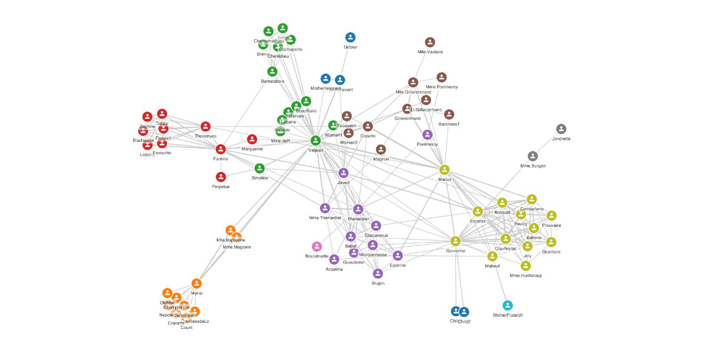

# pixi-graph

[](https://www.npmjs.com/package/pixi-graph)
[](https://www.npmjs.com/package/pixi-graph)
[](https://www.npmjs.com/package/pixi-graph)

Graph visualization library using [PIXI.js](https://www.pixijs.com/) and [Graphology](https://graphology.github.io/).

⚠️ **This is a pre-release, use at your own risk!** Upcoming features can introduce breaking changes in the API.

Developing a full-featured graph visualization library is a significant effort. I'd appreciate your feedback to prioritize new features by filling in a [survey](https://link.zakjan.cz/pixi-graph-survey).

[Demo](https://zakjan.github.io/pixi-graph/)



## Install

```
npm install graphology pixi-graph
```

or

```html
<script src="https://unpkg.com/graphology@0.18.0/dist/graphology.umd.js"></script>
<script src="https://unpkg.com/pixi-graph@1.3.0/dist/pixi-graph.umd.min.js"></script>
```

## Usage

### Basic

```ts
const graph = new graphology.Graph();
// populate Graphology graph with data
// assign layout positions as `x`, `y` node attributes

const pixiGraph = new PixiGraph.PixiGraph({
  container: document.getElementById('graph'),
  graph
});
```

### Layouts

In its simplicity, a graph layout is a function `nodes => positions`. Therefore a layout from any other library can be used. Run the layout separately, and assign layout positions as `x`, `y` node attributes.

[graphology-layout-forceatlas2](https://github.com/graphology/graphology-layout-forceatlas2) example:

```ts
const graph = new graphology.Graph();
// populate Graphology graph with data

graph.forEachNode(node => {
  graph.setNodeAttribute(node, 'x', Math.random());
  graph.setNodeAttribute(node, 'y', Math.random());
});
forceAtlas2.assign(graph, { iterations: 300, settings: { ...forceAtlas2.inferSettings(graph), scalingRatio: 80 }});

const pixiGraph = new PixiGraph.PixiGraph({ ..., graph });
```

### Style

```ts
const style = {
  node: {
    color: '#000000',
  },
  edge: {
    color: '#000000',
  },
};

const pixiGraph = new PixiGraph.PixiGraph({ ..., style });
```

#### Colors

Colors are resolved with [color-rgba](https://github.com/colorjs/color-rgba). The following CSS colors strings are supported: named colors, hex, short-hand hex, RGB, RGBA, HSL, HSLA.

#### Webfonts

Preload fonts before creating PixiGraph with [FontFaceObserver](https://github.com/bramstein/fontfaceobserver).

[Material Icons](https://google.github.io/material-design-icons/) example:

```html
<link href="https://fonts.googleapis.com/icon?family=Material+Icons" rel="stylesheet">
```

```ts
const style = {
  node: {
    icon: {
      content: 'person',
      fontFamily: 'Material Icons',
    },
  },
};

await new FontFaceObserver('Material Icons').load();

const pixiGraph = new PixiGraph.PixiGraph({ ..., style });
```

#### Bitmap fonts

Register bitmap fonts as [resource-loader](https://github.com/englercj/resource-loader) external resource.

```ts
const style = {
  node: {
    label: {
      content: node => node.id,
      type: PixiGraph.TextType.BITMAP_TEXT,
      fontFamily: 'HelveticaRegular',
    },
  },
};

const resources = [
  { name: 'HelveticaRegular', url: 'https://gist.githubusercontent.com/zakjan/b61c0a26d297edf0c09a066712680f37/raw/8cdda3c21ba3668c3dd022efac6d7f740c9f1e18/HelveticaRegular.fnt' },
];

const pixiGraph = new PixiGraph.PixiGraph({ ..., style, resources });
```

#### Hover style

Hover style values override style values when node/edge is hovered.

```ts
const style = {
  node: {
    color: '#000000',
  },
  edge: {
    color: '#000000',
  },
};
const hoverStyle = {
  node: {
    color: '#ff0000',
  },
  edge: {
    color: '#ff0000',
  },
};

const pixiGraph = new PixiGraph.PixiGraph({ ..., style, hoverStyle });
```

⚠️ subject to change with the implementation of other states

## API

```ts
export interface GraphOptions<NodeAttributes extends BaseNodeAttributes = BaseNodeAttributes, EdgeAttributes extends BaseEdgeAttributes = BaseEdgeAttributes> {
  container: HTMLElement;
  graph: Graphology.AbstractGraph<NodeAttributes, EdgeAttributes>;
  style: GraphStyleDefinition<NodeAttributes, EdgeAttributes>;
  hoverStyle: GraphStyleDefinition<NodeAttributes, EdgeAttributes>;
  resources?: ResourceLoader.IAddOptions[];
}

export class PixiGraph<NodeAttributes extends BaseNodeAttributes = BaseNodeAttributes, EdgeAttributes extends BaseEdgeAttributes = BaseEdgeAttributes> {
  constructor(options: GraphOptions<NodeAttributes, EdgeAttributes>);
}
```

- `container` - HTML element to use as a container
- `graph` - [Graphology](https://graphology.github.io/) graph
- `style` - style definition
- `hoverStyle` - additional style definition for hover state
  - ⚠️ subject to change with the implementation of other states
- `resources` - [resource-loader](https://github.com/englercj/resource-loader) external resource definitions
  - resources are passed to loader.add function
  - currently used only for external bitmap fonts

### Style definition

`GraphStyle` interface represents a resolved style, all values are mandatory.

`GraphStyleDefinition` interface allows functions or missing values at any key. Functions are resolved, missing values fall back to a previous definition, or default values.

```ts
export interface GraphStyle {
  node: {
    size: number;
    color: string;
    border: {
      width: number;
      color: string;
    };
    icon: {
      content: string;
      type: TextType;
      fontFamily: string;
      fontSize: number;
      color: string;
    };
    label: {
      content: string;
      type: TextType;
      fontFamily: string;
      fontSize: number;
      color: string;
      backgroundColor: string;
      padding: number;
    };
  };
  edge: {
    width: number;
    color: string;
  };
}

export type NodeStyle = GraphStyle['node'];
export type EdgeStyle = GraphStyle['edge'];

export type StyleDefinition<Style, Attributes> =
  ((attributes: Attributes) => Style) |
  {[Key in keyof Style]?: StyleDefinition<Style[Key], Attributes>} |
  Style;

export interface GraphStyleDefinition<NodeAttributes extends BaseNodeAttributes = BaseNodeAttributes, EdgeAttributes extends BaseEdgeAttributes = BaseEdgeAttributes> {
  node?: StyleDefinition<NodeStyle, NodeAttributes>;
  edge?: StyleDefinition<EdgeStyle, EdgeAttributes>;
}
```

This allows either static styles, or data-driven styles at any style definition level. Each function is resolved only once.

```ts
const style = {
  node: {
    color: '#000000',
  },
};
```

or

```ts
const style = {
  node: {
    color: node => colors[node.group % colors.length],
  },
};
```

or

```ts
const style = {
  node: node => {
    const color = colors[node.group % colors.length];
    return { color };
  },
};
```

### Events

Node events:

- nodeClick
- nodeMousemove
- nodeMouseover
- nodeMouseout
- nodeMousedown
- nodeMouseup

```ts
pixiGraph.on('nodeClick', (event, nodeKey) => ...);
```

Edge events:

- edgeClick
- edgeMousemove
- edgeMouseover
- edgeMouseout
- edgeMousedown
- edgeMouseup

```ts
pixiGraph.on('edgeClick', (event, edgeKey) => ...);
```

## Sponsors

<a href="https://reflect.app/"></a>